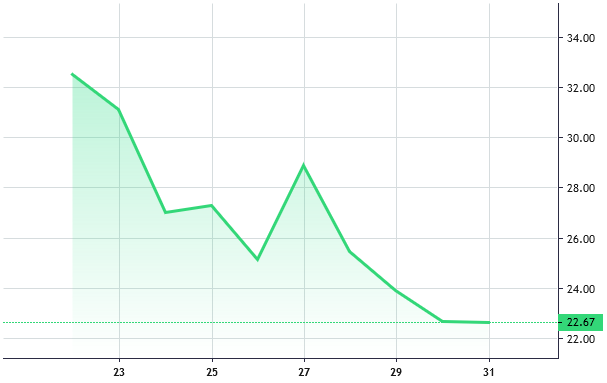

# Area series

An area chart is another way of displaying quantitative data. It's basically a colored area between the line connecting all data points and the time scale.

An area series has a crosshair marker - a round mark which is moving along the series' line while the cursor is moving on a chart along the time scale.



## How to create area series

```javascript
const areaSeries = chart.addAreaSeries();

// set the data
areaSeries.setData([
    { time: "2018-12-22", value: 32.51 },
    { time: "2018-12-23", value: 31.11 },
    { time: "2018-12-24", value: 27.02 },
    { time: "2018-12-25", value: 27.32 },
    { time: "2018-12-26", value: 25.17 },
    { time: "2018-12-27", value: 28.89 },
    { time: "2018-12-28", value: 25.46 },
    { time: "2018-12-29", value: 23.92 },
    { time: "2018-12-30", value: 22.68 },
    { time: "2018-12-31", value: 22.67 },
]);
```

## Data format

Each area series item should have the following field:

- `time` ([Time](./time.md)) - item time
- `value` (`number`) - item value

## Customization

Color, style and width setting options are provided for the upper line of an area series.

Different colors may be set for the upper and bottom parts of an area.
These colors blend into one another in the middle of the area.

Also, the crosshair marker, which is enabled by default, can either be disabled or have its radius adjusted.

An area series interface can be customized using the following set of options:

|Name|Type|Default|Description|
|-|----|-------|-|
|`topColor`|`string`|`rgba(46, 220, 135, 0.4)`|Area top color|
|`bottomColor`|`string`|`rgba(40, 221, 100, 0)`|Area bottom color|
|`lineColor`|`string`|`#33D778`|Line color|
|`lineStyle`|[LineStyle](./constants.md#linestyle)|`LineStyle.Solid`|Line style|
|`lineWidth`|`number`|`3`|Line width in pixels|
|`crosshairMarkerVisible`|`boolean`|`true`|If true, the crosshair marker is shown|
|`crosshairMarkerRadius`|`number`|`4`|The radius of the crosshair marker in pixels|

### Examples

- set initial options for area series:

    ```javascript
    const areaSeries = chart.addAreaSeries({
        topColor: 'rgba(21, 146, 230, 0.4)',
        bottomColor: 'rgba(21, 146, 230, 0)',
        lineColor: 'rgba(21, 146, 230, 1)',
        lineStyle: 0,
        lineWidth: 3,
        crosshairMarkerVisible: false,
        crosshairMarkerRadius: 3,
    });
    ```

- change options after series is created:

    ```javascript
    // for example, let's override line width and color only
    areaSeries.applyOptions({
        lineColor: 'rgba(255, 44, 128, 1)',
        lineWidth: 1,
    });
    ```

## What's next

- [Customization](./customization.md)
- [Constants](./constants.md)
- [Time](./time.md)
