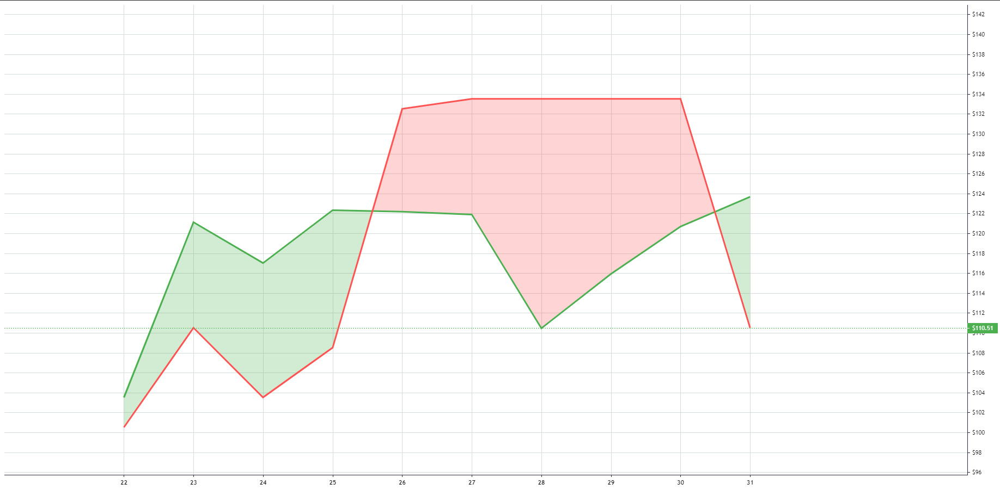

# Cloud Area series

A cloud area chart is a way to show two quantitative data and compare them in a glance. It's basically a colored area between two lines connecting all data points of each series and the timescale.

A cloud area series has a crosshair marker - a round mark which is moving along the lower series' line while the cursor is moving on a chart along the timescale.



## How to create area series

```js
const cloudAreaChart = cloudAreaChart.addAreaSeries();

// set the data
cloudAreaChart.setData([
    { time: '2018-12-22', higherValue: 103.51, lowerValue: 100.51 },
    { time: '2018-12-23', higherValue: 121.11, lowerValue: 110.51 },
    { time: '2018-12-24', higherValue: 117.02, lowerValue: 103.51 },
    { time: '2018-12-25', higherValue: 122.32, lowerValue: 108.51 },
    { time: '2018-12-26', higherValue: 122.17, lowerValue: 132.51 },
    { time: '2018-12-27', higherValue: 121.89, lowerValue: 133.51 },
    { time: '2018-12-28', higherValue: 110.46, lowerValue: 133.51 },
    { time: '2018-12-29', higherValue: 115.92, lowerValue: 133.51 },
    { time: '2018-12-30', higherValue: 120.68, lowerValue: 133.51 },
    { time: '2018-12-31', higherValue: 123.67, lowerValue: 110.51 },
]);
```

## Data format

Each area series item should be a [whitespace](./whitespace-data.md) item or an object with the following fields:

- `time` ([Time](./time.md)) - item time
- `higherValue` (`number`) - the value of the item which is expected to be higher (default: green line)
- `lowerValue` (`number`) - the value of the item which is expected to be lower (default: red line)

## Customization

Color, style and width setting options are provided for the higher line and lower line of a cloud area series.

Different colors may be set for unexpected and expected order of an area.

Also, the crosshair marker, which is enabled by default, can either be disabled or have its radius adjusted.

A cloud area series interface can be customized using the following set of options:

|Name|Type|Default|Description|
|-|----|-------|-|
|`topColor`|`string`|`rgba( 76, 175, 80, 0.1)`|Area top color|
|`bottomColor`|`string`|`rgba( 255, 82, 82, 0.1)`|Area bottom color|
|`higherLineColor`|`string`|`#4CAF50`|Line color|
|`higherLineStyle`|[LineStyle](./constants.md#linestyle)|`LineStyle.Solid`|Line style|
|`higherLineWidth`|`number`|`3`|Line width in pixels|
|`lowerLineColor`|`string`|`#FF5252`|Line color|
|`lowerLineStyle`|[LineStyle](./constants.md#linestyle)|`LineStyle.Solid`|Line style|
|`lowerLineWidth`|`number`|`3`|Line width in pixels|
|`crosshairMarkerVisible`|`boolean`|`true`|If true, the crosshair marker is shown|
|`crosshairMarkerRadius`|`number`|`4`|The radius of the crosshair marker in pixels|
|`crosshairMarkerBorderColor`|`string`|`''`|The crosshair border color (an empty string fallbacks the color to series' color under the crosshair)|
|`crosshairMarkerBackgroundColor`|`string`|`''`|The crosshair back color (an empty string fallbacks the color to series' color under the crosshair)|

### Examples

- set initial options for cloud area series:

    ```js
    const areaSeries = chart.addAreaSeries({
        positiveColor: 'rgba( 76, 175, 80, 0.25)',
        negativeColor: 'rgba( 255, 82, 82, 0.25)',
        crosshairMarkerVisible: false,
        crosshairMarkerRadius: 3,
        crosshairMarkerBorderColor: 'rgb(255, 255, 255, 1)',
        crosshairMarkerBackgroundColor: 'rgb(34, 150, 243, 1)',
    });
    ```

- change options after series is created:

    ```js
    // for example, let's override line width and color only
    areaSeries.applyOptions({
        higherLineColor: 'rgba(255, 44, 128, 1)',
        higherLineWidth: 1,
    });
    ```

## What's next

- [Customization](./customization.md)
- [Constants](./constants.md)
- [Time](./time.md)
