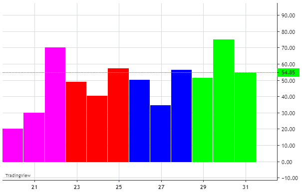

# Histogram series

A histogram series is a graphical representation of the value distribution.

Histogram creates intervals (columns) and counts how many values fall into each column.



## How to create histogram series

```javascript
const histogramSeries = chart.addHistogramSeries({
    base: 0,
});

// set the data
histogramSeries.setData([
    { time: "2018-12-20", value: 20.31, color: "#ff00ff" },
    { time: "2018-12-21", value: 30.27, color: "#ff00ff" },
    { time: "2018-12-22", value: 70.28, color: "#ff00ff" },
    { time: "2018-12-23", value: 49.29, color: "#ff0000" },
    { time: "2018-12-24", value: 40.64, color: "#ff0000" },
    { time: "2018-12-25", value: 57.46, color: "#ff0000" },
    { time: "2018-12-26", value: 50.55, color: "#0000ff" },
    { time: "2018-12-27", value: 34.85, color: "#0000ff" },
    { time: "2018-12-28", value: 56.68, color: "#0000ff" },
    { time: "2018-12-29", value: 51.60, color: "#00ff00" },
    { time: "2018-12-30", value: 75.33, color: "#00ff00" },
    { time: "2018-12-31", value: 54.85, color: "#00ff00" }
]);
```

## Data format

Each item of the histogram series should include the following field:

- `time` ([Time](./time.md)) - item time
- `value` (`number`) - item value
- `color` (`string`, optional) - optional color of an item

Note: if `color` is not set then an item will be colored according to series options.

## Customization

A histogram series interface can be customized using the following options:

|Name|Type|Default|Description|
|----|----|-------|-|
|`color`|`string`|`#26a69a`|Column color|
|`base`|`number`|`0`|Defines initial level for histogram columns|

### Examples

- set initial options for histogram series:

    ```javascript
    const histogramSeries = chart.addHistogramSeries({
        color: '#FFF5EE',
        base: 5,
    });
    ```

- change options after series is created:

    ```javascript
    // for example, let's override default initial level:
    histogramSeries.applyOptions({
        base: -10,
    });
    ```

## What's next

- [Customization](./customization.md)
- [Constants](./constants.md)
- [Time](./time.md)
