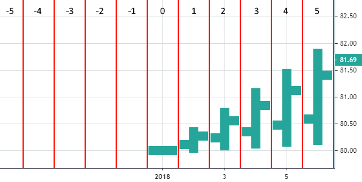

# Time Scale

Time scale (or time axis) is a horizontal scale at the bottom of the chart that displays the time of bars.

## Time scale options

|Name|Type|Default|Description|
|----------------------------|-------|-------|--|
|`rightOffset`|`number`|`0`|Sets the margin space in bars from the right side of the chart|
|`barSpacing`|`number`|`6`|Sets the space between bars in pixels|
|`fixLeftEdge`|`boolean`|`false`|If true, prevents scrolling to the left of the first historical bar|
|`lockVisibleTimeRangeOnResize`|`boolean`|`false`|If true, prevents changing visible time area during chart resizing|
|`rightBarStaysOnScroll`|`boolean`|`false`|If false, the hovered bar remains in the same place when scrolling|
|`borderVisible`|`boolean`|`true`|If true, the time scale border is visible|
|`borderColor`|`string`|`#2b2b43`|The time scale border color|
|`visible`|`boolean`|`true`|If true, the time scale is shown on a chart|
|`timeVisible`|`boolean`|`false`|If true, the time is shown on the time scale and in the vertical crosshair label|
|`secondsVisible`|`boolean`|`true`|If true, seconds are shown on the label of the crosshair vertical line in `hh:mm:ss` format on intraday intervals|
|`tickMarkFormatter`|`(TimePoint, TickMarkType, locale) => string`|Default tick marks formatter|Allows to override the tick marks formatter (see below)|

### Tick marks formatter

Tick marks formatter can be used to customize tick marks labels on the time axis.

To customize it, you need to provide the `tickMarkFormatter` option. It's a function with the following declaration:

```typescript
export type TickMarkFormatter = (timePoint: TimePoint, tickMarkType: TickMarkType, locale: string) => string;
```

Where `timePoint` is [Time](./time.md) object, `type` is [TickMarkType](./constants.md#TickMarkType) enum and `locale` is the currently applied locale of the string type.

This function should return `timePoint` as a string formatted according to `tickMarkType` type (year, month, etc) and `locale`.

Note that the returned string should be the shortest possible value and should have no more than 8 characters.
Otherwise, the tick marks will overlap each other.

### Example of time scale customization

```javascript
chart.applyOptions({
    timeScale: {
        rightOffset: 12,
        barSpacing: 3,
        fixLeftEdge: true,
        lockVisibleTimeRangeOnResize: true,
        rightBarStaysOnScroll: true,
        borderVisible: false,
        borderColor: '#fff000',
        visible: true,
        timeVisible: true,
        secondsVisible: false,
        tickMarkFormatter: function(timePoint, tickMarkType, locale) {
            console.log(timePoint, tickMarkType, locale);
            return String(new Date(timePoint.timestamp * 1000).getUTCFullYear());
        },
    },
});
```

## Time scale API

### scrollPosition()

Returns a distance from the right edge of the time scale to the latest bar of the series, measured in bars.

```javascript
chart.timeScale().scrollPosition();
```

### scrollToPosition()

Function scrolls the chart to the specified position in time. It has the following arguments:

`position` - amount of time points from the latest bar

`animated` - if true, the series is scrolled smoothly with animation

```javascript
chart.timeScale().scrollToPosition(2, true);
```

### scrollToRealTime()

Restores default scroll position of the chart. This process is always animated.

```javascript
chart.timeScale().scrollToRealTime();
```

### getVisibleRange()

Returns the current visible time range of the chart as an object with the first and last time points of the time range, or returns `null` if the chart has no data at all.

```javascript
chart.timeScale().getVisibleRange();
```

### setVisibleRange()

Sets visible time range of the chart. The argument is an object with the first and last time points of a desired time range.

```javascript
chart.timeScale().setVisibleRange({
    from: (new Date(Date.UTC(2018, 0, 1, 0, 0, 0, 0))).getTime() / 1000,
    to: (new Date(Date.UTC(2018, 1, 1, 0, 0, 0, 0))).getTime() / 1000,
});
```

### getVisibleLogicalRange

Returns the current visible [logical range](#logical-range) of the chart as an object with the first and last time points of the logical range, or returns `null` if the chart has no data at all.

```javascript
chart.timeScale().getVisibleLogicalRange();
```

### setVisibleLogicalRange

Sets visible [logical range](#logical-range) of the chart.
The argument is an object with the first and last time points of a desired logical range.

```javascript
chart.timeScale().setVisibleLogicalRange({
    from: 0,
    to: 10,
});
```

### resetTimeScale()

Restores default zoom and scroll position of the time scale.

```javascript
chart.timeScale().resetTimeScale();
```

### fitContent()

Automatically calculates the visible range to fit all series data.

```javascript
chart.timeScale().fitContent();
```

### timeToCoordinate

Converts a time to local `x` coordinate.
The argument is [Time](./time.md) that needs to be converted to a coordinate.

Returns `x` coordinate of a bar with passed time or `null` if no bar found.

```javascript
chart.timeScale().timeToCoordinate('1990-04-24');
```

### coordinateToTime

Converts `x` coordinate to [Time](./time.md).
The argument is `x` coordinate that needs to be converted to a time.

Returns [Time](./time.md) of a bar that is located on the passed coordinate or `null` if there are no bars on that coordinate.

```javascript
chart.timeScale().coordinateToTime(42);
```

### applyOptions()

Applies new options to the time scale. The argument is an object with options that should be modified.

```javascript
chart.timeScale().applyOptions({
    rightOffset:12,
    borderVisible: false,
});
```

### options()

Returns an object with options currently applied to the time scale.

```javascript
chart.timeScale().options();
```

### subscribeVisibleTimeRangeChange

Allows to subscribe to the visible time range changed event.
The argument is a handler function, which will be called with the new visible time range.

The argument passed to your handler is the new visible time range, which might be either:

- an object with properties `from` and `to` of type [Time](./time.md), that are the first and last visible time points, respectively
- `null` if nothing is visible or the chart has no data at all

```javascript
function onVisibleTimeRangeChanged(newVisibleTimeRange) {
    console.log(newVisibleTimeRange);
}

chart.timeScale().subscribeVisibleTimeRangeChange(onVisibleTimeRangeChanged);
```

### unsubscribeVisibleTimeRangeChange

Allows to unsubscribe the previously subscribed handler from the visible time range changed event.
The argument is a handler function, which you've passed to the [`subscribeVisibleTimeRangeChange`](#subscribeVisibleTimeRangeChange).

```javascript
chart.timeScale().unsubscribeVisibleTimeRangeChange(onVisibleTimeRangeChanged);
```

### subscribeVisibleLogicalRangeChange

Allows to subscribe to the visible [logical range](#logical-range) changed event.
The argument is a handler function, which will be called with the new visible logical range.

The argument passed to your handler is the new visible logical range, which might be either:

- an object with numerical properties `from` and `to` of type number (see [Logical range](#logical-range) section), that are the first and last visible logical indexes, respectively
- `null` if the chart has no data at all

```javascript
function onVisibleLogicalRangeChanged(newVisibleLogicalRange) {
    console.log(newVisibleLogicalRange);
}

chart.timeScale().subscribeVisibleLogicalRangeChange(onVisibleLogicalRangeChanged);
```

### unsubscribeVisibleLogicalRangeChange

Allows to unsubscribe the previously subscribed handler from the visible logical range changed event.
The argument is a handler function, which you've passed to the [`subscribeVisibleLogicalRangeChange`](#subscribeVisibleLogicalRangeChange).

```javascript
chart.timeScale().unsubscribeVisibleLogicalRangeChange(onVisibleLogicalRangeChanged);
```

## Logical range

Logical range is an object with 2 properties: `from` and `to`, which are numbers and represent logical indexes on the time scale.

The starting point of the time scale's logical range is the first data item among all series.
Before that point all indexes are negative, starting from that point - positive.

Indexes might have fractional parts, for instance 4.2, due to the time-scale being continuous rather than discrete.

Integer part of logical index means index of the fully visible bar (see image below).
Thus, if we have 5.2 as the last visible logical index (`to` field), that means that the last visible bar has index 5, but we also have partially visible (for 20%) 6th bar.
Half (e.g. 1.5, 3.5, 10.5) means exactly middle of the bar.



Red vertical lines here are borders between bars.

Thus, the visible logical range in the image above is from -4.73 to 5.05.
